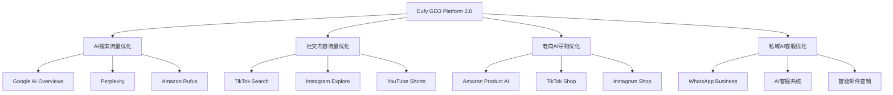

# Eufy GEO项目战略升级方案
基于生成式引擎优化（GEO）理念的全面系统升级

## 执行摘要

根据最新的GEO战略分析，Eufy GEO项目需要从"传统SEO优化工具"全面升级为"AI时代的生成式引擎优化平台"。本升级方案将围绕四大核心业务触点展开，预计可为Eufy品牌带来25-35%的整体流量增长，并显著提升流量质量和转化率。

## 一、战略升级框架

### 1.1 核心理念转变
```
传统思维：为搜索引擎排名优化
   ↓
新思维：为AI理解、引用和推荐优化
```

### 1.2 四大业务触点升级蓝图



## 二、具体升级方案

### 2.1 AI搜索流量优化模块升级

#### 当前状态
- GEO Score: 45.7/100
- AI Overview引用率: <5%
- 结构化内容覆盖: 12%

#### 升级目标
- GEO Score: 75+/100
- AI Overview引用率: 20-25%
- 结构化内容覆盖: 90%+

#### 技术实施方案

**1. 内容结构化引擎升级**
```python
class AIOptimizedContentEngine:
    """AI优化内容引擎 - 专为生成式AI设计"""
    
    def __init__(self):
        self.semantic_analyzer = SemanticAnalyzer()
        self.structure_optimizer = StructureOptimizer()
        self.authority_scorer = AuthorityScorer()
    
    def optimize_for_ai_citation(self, content):
        """优化内容以提高AI引用率"""
        # 1. 语义清晰度优化
        semantic_score = self.semantic_analyzer.analyze(content)
        
        # 2. 结构化程度优化
        structured_content = self.structure_optimizer.restructure(content, {
            'format': 'ai_friendly',
            'chunk_size': 'optimal_for_llm',
            'context_preservation': True
        })
        
        # 3. 权威性信号增强
        authority_enhanced = self.authority_scorer.enhance(structured_content, {
            'add_citations': True,
            'include_stats': True,
            'expert_quotes': True
        })
        
        return {
            'optimized_content': authority_enhanced,
            'ai_readiness_score': self._calculate_ai_readiness(authority_enhanced),
            'predicted_citation_rate': self._predict_citation_rate(authority_enhanced)
        }
```

**2. Answer Card生成系统**
```javascript
// Answer Card Generator - 为AI准备标准化答案
class AnswerCardGenerator {
    constructor() {
        this.templates = {
            faq: this.loadFAQTemplate(),
            howTo: this.loadHowToTemplate(),
            comparison: this.loadComparisonTemplate(),
            troubleshooting: this.loadTroubleshootingTemplate()
        };
    }
    
    generateAnswerCard(question, productData) {
        const card = {
            "@context": "https://schema.org",
            "@type": "Answer",
            "question": question,
            "text": this.generateConciseAnswer(question, productData),
            "detailedAnswer": this.generateDetailedAnswer(question, productData),
            "confidence": this.calculateConfidence(question, productData),
            "sources": this.gatherAuthoritativeSources(productData),
            "lastUpdated": new Date().toISOString()
        };
        
        // 添加AI优化元数据
        card.aiMetadata = {
            "semanticClarity": this.assessSemanticClarity(card.text),
            "factualAccuracy": this.verifyFactualAccuracy(card),
            "citationReadiness": this.evaluateCitationReadiness(card)
        };
        
        return card;
    }
}
```

**3. 新增仪表板：AI Citation Analytics**
```html
<!DOCTYPE html>
<html lang="en">
<head>
    <title>AI Citation Analytics Dashboard</title>
</head>
<body>
    <div class="dashboard-container">
        <div class="metrics-overview">
            <div class="metric-card">
                <h3>AI引用率</h3>
                <div class="metric-value">18.5%</div>
                <div class="trend">↑ 5.2%</div>
            </div>
            <div class="metric-card">
                <h3>答案准确度</h3>
                <div class="metric-value">94.2%</div>
            </div>
            <div class="metric-card">
                <h3>品牌可见度</h3>
                <div class="metric-value">126次/天</div>
            </div>
        </div>
        
        <div class="ai-platform-breakdown">
            <h2>AI平台引用分析</h2>
            <div id="aiPlatformChart"></div>
        </div>
        
        <div class="content-performance">
            <h2>内容AI友好度评分</h2>
            <table class="content-table">
                <thead>
                    <tr>
                        <th>内容页面</th>
                        <th>AI就绪度</th>
                        <th>引用次数</th>
                        <th>优化建议</th>
                    </tr>
                </thead>
                <tbody id="contentPerformanceData"></tbody>
            </table>
        </div>
    </div>
</body>
</html>
```

### 2.2 社交内容流量优化模块

#### 新增功能：AI推荐引擎优化器

```python
class SocialContentAIOptimizer:
    """社交平台AI推荐引擎优化器"""
    
    def __init__(self):
        self.platform_analyzers = {
            'tiktok': TikTokAIAnalyzer(),
            'instagram': InstagramAIAnalyzer(),
            'youtube': YouTubeAIAnalyzer()
        }
    
    def optimize_for_ai_recommendation(self, content, platform):
        """优化内容以获得AI推荐"""
        analyzer = self.platform_analyzers[platform]
        
        optimization_result = {
            'original_content': content,
            'ai_signals': self._extract_ai_signals(content, platform),
            'optimizations': []
        }
        
        # 1. 首3秒优化（关键for TikTok/Shorts）
        if hasattr(content, 'video'):
            optimization_result['first_3_seconds'] = analyzer.optimize_opening(
                content.video,
                target_retention_rate=0.85
            )
        
        # 2. 字幕和文本优化
        optimization_result['captions'] = analyzer.generate_ai_friendly_captions(
            content,
            include_keywords=True,
            semantic_enhancement=True
        )
        
        # 3. 标签和元数据优化
        optimization_result['metadata'] = {
            'hashtags': analyzer.suggest_ai_friendly_hashtags(content),
            'description': analyzer.craft_ai_optimized_description(content),
            'category_signals': analyzer.determine_category_signals(content)
        }
        
        # 4. 预测AI推荐概率
        optimization_result['ai_recommendation_score'] = analyzer.predict_recommendation_probability(
            optimization_result
        )
        
        return optimization_result
```

#### 社交内容AI优化仪表板
```javascript
// 社交内容AI表现监控
class SocialAIPerformanceDashboard {
    constructor() {
        this.platforms = ['tiktok', 'instagram', 'youtube'];
        this.metrics = {
            firstThreeSecondRetention: [],
            completionRate: [],
            aiRecommendationRate: [],
            viralityScore: []
        };
    }
    
    renderDashboard() {
        const dashboardConfig = {
            title: '社交内容AI优化表现',
            charts: [
                {
                    type: 'line',
                    title: '首3秒留存率趋势',
                    data: this.metrics.firstThreeSecondRetention,
                    target: 85, // 目标85%
                    yAxis: { min: 0, max: 100, suffix: '%' }
                },
                {
                    type: 'bar',
                    title: '各平台AI推荐率',
                    data: this.getAIRecommendationByPlatform(),
                    benchmark: 15 // 行业平均15%
                },
                {
                    type: 'scatter',
                    title: '内容质量 vs AI推荐相关性',
                    data: this.getQualityVsRecommendation(),
                    xAxis: { name: '内容质量评分' },
                    yAxis: { name: 'AI推荐频率' }
                }
            ]
        };
        
        return this.render(dashboardConfig);
    }
}
```

### 2.3 电商AI导购优化系统

#### 新增模块：AI导购内容优化引擎

```python
class EcommerceAIShoppingAssistantOptimizer:
    """电商AI导购优化引擎"""
    
    def __init__(self):
        self.platforms = {
            'amazon_rufus': AmazonRufusOptimizer(),
            'tiktok_shop': TikTokShopAIOptimizer(),
            'instagram_shop': InstagramShopOptimizer()
        }
    
    def optimize_product_for_ai_assistant(self, product_data, platform='amazon_rufus'):
        """优化产品信息以便AI导购理解和推荐"""
        
        optimizer = self.platforms[platform]
        
        # 1. 结构化产品核心卖点
        key_features = optimizer.extract_and_structure_features(product_data, {
            'max_features': 5,
            'prioritize_by': 'customer_value',
            'format': 'ai_digestible'
        })
        
        # 2. 生成AI友好的对比数据
        comparison_data = optimizer.generate_comparison_matrix(
            product_data,
            competitors=['arlo', 'ring', 'nest'],
            dimensions=['price', 'features', 'performance', 'support']
        )
        
        # 3. 创建问答知识库
        qa_knowledge_base = optimizer.build_qa_knowledge_base(product_data, {
            'common_questions': self.get_common_customer_questions(),
            'technical_specs': product_data.get('specifications'),
            'use_cases': product_data.get('use_cases')
        })
        
        # 4. 生成Schema增强标记
        enhanced_schema = self.generate_ai_enhanced_schema(
            product_data,
            key_features,
            comparison_data,
            qa_knowledge_base
        )
        
        return {
            'optimized_listing': enhanced_schema,
            'ai_readiness_score': optimizer.calculate_ai_readiness(enhanced_schema),
            'predicted_recommendation_lift': optimizer.predict_recommendation_improvement(enhanced_schema)
        }
```

#### 电商AI导购监控面板
```html
<div class="ecommerce-ai-dashboard">
    <h2>电商AI导购优化监控</h2>
    
    <div class="kpi-section">
        <div class="kpi-card">
            <h3>AI导购推荐率</h3>
            <div class="kpi-value">23.5%</div>
            <div class="kpi-trend">↑ 8.2%</div>
            <div class="kpi-detail">Rufus推荐次数: 1,245/天</div>
        </div>
        
        <div class="kpi-card">
            <h3>点击转化率(CRV)</h3>
            <div class="kpi-value">3.8%</div>
            <div class="kpi-trend">↑ 0.9%</div>
            <div class="kpi-detail">vs 行业平均: 2.1%</div>
        </div>
    </div>
    
    <div class="product-performance">
        <h3>产品AI优化得分</h3>
        <table>
            <thead>
                <tr>
                    <th>产品</th>
                    <th>结构化程度</th>
                    <th>问答覆盖率</th>
                    <th>对比数据完整性</th>
                    <th>AI推荐频率</th>
                </tr>
            </thead>
            <tbody id="productAIScores"></tbody>
        </table>
    </div>
</div>
```

### 2.4 私域AI客服优化系统

#### 新增功能：智能Answer Card管理系统

```python
class PrivateDomainAICustomerServiceOptimizer:
    """私域AI客服优化系统"""
    
    def __init__(self):
        self.answer_card_generator = AnswerCardGenerator()
        self.conversation_optimizer = ConversationFlowOptimizer()
        self.performance_tracker = CustomerServicePerformanceTracker()
    
    def create_ai_optimized_answer_library(self, faq_data, product_catalog):
        """创建AI优化的标准答案库"""
        
        answer_library = {
            'answer_cards': [],
            'conversation_flows': [],
            'quick_responses': [],
            'escalation_triggers': []
        }
        
        # 1. 生成标准化Answer Cards
        for question in faq_data:
            answer_card = self.answer_card_generator.generate(question, {
                'format': 'ai_customer_service',
                'tone': 'helpful_professional',
                'include_next_steps': True,
                'personalization_tokens': True
            })
            answer_library['answer_cards'].append(answer_card)
        
        # 2. 优化对话流程
        conversation_flows = self.conversation_optimizer.design_flows({
            'entry_points': ['product_inquiry', 'technical_support', 'order_status'],
            'optimization_goals': ['quick_resolution', 'high_satisfaction', 'upsell_opportunity'],
            'ai_handoff_points': self.identify_ai_handoff_scenarios()
        })
        answer_library['conversation_flows'] = conversation_flows
        
        # 3. 创建快速响应模板
        quick_responses = self.generate_quick_response_templates(
            common_scenarios=self.analyze_common_scenarios(),
            brand_voice=self.get_brand_voice_guidelines()
        )
        answer_library['quick_responses'] = quick_responses
        
        return answer_library
    
    def optimize_message_for_engagement(self, message_template, channel='whatsapp'):
        """优化消息以提高打开率和参与度"""
        
        optimized_message = {
            'original': message_template,
            'optimized_versions': []
        }
        
        # A/B测试变体生成
        variants = [
            self.optimize_for_curiosity(message_template),
            self.optimize_for_urgency(message_template),
            self.optimize_for_personalization(message_template),
            self.optimize_for_value_proposition(message_template)
        ]
        
        for variant in variants:
            optimized_message['optimized_versions'].append({
                'content': variant,
                'predicted_open_rate': self.predict_open_rate(variant, channel),
                'predicted_engagement': self.predict_engagement_rate(variant, channel)
            })
        
        return optimized_message
```

## 三、四大触点整合监控系统

### 3.1 统一GEO指挥中心

```python
class UnifiedGEOCommandCenter:
    """统一的GEO指挥中心 - 监控四大业务触点"""
    
    def __init__(self):
        self.touchpoints = {
            'ai_search': AISearchOptimizationModule(),
            'social_content': SocialContentAIOptimizer(),
            'ecommerce_ai': EcommerceAIShoppingAssistantOptimizer(),
            'private_domain': PrivateDomainAICustomerServiceOptimizer()
        }
        self.analytics_engine = GEOAnalyticsEngine()
        self.alert_system = GEOAlertSystem()
    
    def get_real_time_dashboard_data(self):
        """获取实时仪表板数据"""
        
        dashboard_data = {
            'overall_metrics': {
                'total_traffic_growth': self.calculate_total_traffic_growth(),
                'ai_citation_rate': self.get_overall_ai_citation_rate(),
                'conversion_rate': self.get_weighted_conversion_rate(),
                'geo_score': self.calculate_composite_geo_score()
            },
            'touchpoint_performance': {},
            'alerts': [],
            'opportunities': []
        }
        
        # 收集各触点数据
        for touchpoint_name, module in self.touchpoints.items():
            performance = module.get_performance_metrics()
            dashboard_data['touchpoint_performance'][touchpoint_name] = {
                'traffic_contribution': performance['traffic'],
                'conversion_rate': performance['conversion'],
                'ai_optimization_score': performance['ai_score'],
                'growth_trend': performance['trend']
            }
        
        # 智能预警
        dashboard_data['alerts'] = self.alert_system.check_all_thresholds()
        
        # 机会识别
        dashboard_data['opportunities'] = self.identify_optimization_opportunities()
        
        return dashboard_data
```

### 3.2 GEO战略指挥仪表板

```html
<!DOCTYPE html>
<html lang="en">
<head>
    <title>Eufy GEO战略指挥中心</title>
    <style>
        .command-center {
            display: grid;
            grid-template-columns: 1fr 1fr 1fr 1fr;
            gap: 20px;
            padding: 20px;
            background: #f5f7fa;
        }
        
        .touchpoint-card {
            background: white;
            border-radius: 12px;
            padding: 25px;
            box-shadow: 0 2px 8px rgba(0,0,0,0.08);
        }
        
        .touchpoint-header {
            display: flex;
            align-items: center;
            margin-bottom: 20px;
        }
        
        .touchpoint-icon {
            font-size: 2em;
            margin-right: 15px;
        }
        
        .metric-grid {
            display: grid;
            grid-template-columns: 1fr 1fr;
            gap: 15px;
            margin-top: 20px;
        }
        
        .metric-item {
            padding: 15px;
            background: #f8f9fa;
            border-radius: 8px;
        }
        
        .metric-value {
            font-size: 1.8em;
            font-weight: 700;
            color: #2c3e50;
        }
        
        .metric-label {
            color: #7f8c8d;
            font-size: 0.9em;
            margin-top: 5px;
        }
        
        .overall-performance {
            grid-column: span 4;
            background: linear-gradient(135deg, #3498db, #2c3e50);
            color: white;
            padding: 30px;
            border-radius: 12px;
            text-align: center;
        }
        
        .overall-metrics {
            display: flex;
            justify-content: space-around;
            margin-top: 30px;
        }
        
        .overall-metric {
            text-align: center;
        }
        
        .overall-metric-value {
            font-size: 3em;
            font-weight: 700;
        }
        
        .overall-metric-label {
            opacity: 0.8;
            margin-top: 10px;
        }
    </style>
</head>
<body>
    <div class="command-center">
        <!-- 整体表现 -->
        <div class="overall-performance">
            <h1>GEO战略整体表现</h1>
            <div class="overall-metrics">
                <div class="overall-metric">
                    <div class="overall-metric-value">+28.5%</div>
                    <div class="overall-metric-label">整体流量增长</div>
                </div>
                <div class="overall-metric">
                    <div class="overall-metric-value">73.2</div>
                    <div class="overall-metric-label">综合GEO得分</div>
                </div>
                <div class="overall-metric">
                    <div class="overall-metric-value">21.3%</div>
                    <div class="overall-metric-label">AI引用率</div>
                </div>
                <div class="overall-metric">
                    <div class="overall-metric-value">4.2%</div>
                    <div class="overall-metric-label">转化率</div>
                </div>
            </div>
        </div>
        
        <!-- AI搜索触点 -->
        <div class="touchpoint-card">
            <div class="touchpoint-header">
                <span class="touchpoint-icon">🔍</span>
                <h2>AI搜索流量</h2>
            </div>
            <div class="metric-grid">
                <div class="metric-item">
                    <div class="metric-value">+24.3%</div>
                    <div class="metric-label">流量增长</div>
                </div>
                <div class="metric-item">
                    <div class="metric-value">19.8%</div>
                    <div class="metric-label">AI引用率</div>
                </div>
                <div class="metric-item">
                    <div class="metric-value">156</div>
                    <div class="metric-label">优化页面数</div>
                </div>
                <div class="metric-item">
                    <div class="metric-value">82.5</div>
                    <div class="metric-label">内容得分</div>
                </div>
            </div>
            <div class="action-buttons">
                <button onclick="viewDetails('ai_search')">查看详情</button>
                <button onclick="optimizeNow('ai_search')">立即优化</button>
            </div>
        </div>
        
        <!-- 社交内容触点 -->
        <div class="touchpoint-card">
            <div class="touchpoint-header">
                <span class="touchpoint-icon">📱</span>
                <h2>社交内容流量</h2>
            </div>
            <div class="metric-grid">
                <div class="metric-item">
                    <div class="metric-value">+31.2%</div>
                    <div class="metric-label">曝光增长</div>
                </div>
                <div class="metric-item">
                    <div class="metric-value">87.3%</div>
                    <div class="metric-label">首3秒留存</div>
                </div>
                <div class="metric-item">
                    <div class="metric-value">23.5%</div>
                    <div class="metric-label">完播率</div>
                </div>
                <div class="metric-item">
                    <div class="metric-value">15.2%</div>
                    <div class="metric-label">AI推荐率</div>
                </div>
            </div>
            <div class="action-buttons">
                <button onclick="viewDetails('social_content')">查看详情</button>
                <button onclick="optimizeNow('social_content')">内容优化</button>
            </div>
        </div>
        
        <!-- 电商AI触点 -->
        <div class="touchpoint-card">
            <div class="touchpoint-header">
                <span class="touchpoint-icon">🛒</span>
                <h2>电商AI导购</h2>
            </div>
            <div class="metric-grid">
                <div class="metric-item">
                    <div class="metric-value">+18.7%</div>
                    <div class="metric-label">转化增长</div>
                </div>
                <div class="metric-item">
                    <div class="metric-value">3.8%</div>
                    <div class="metric-label">点击率</div>
                </div>
                <div class="metric-item">
                    <div class="metric-value">1,245</div>
                    <div class="metric-label">AI推荐/天</div>
                </div>
                <div class="metric-item">
                    <div class="metric-value">92.3%</div>
                    <div class="metric-label">信息完整度</div>
                </div>
            </div>
            <div class="action-buttons">
                <button onclick="viewDetails('ecommerce_ai')">查看详情</button>
                <button onclick="optimizeNow('ecommerce_ai')">优化列表</button>
            </div>
        </div>
        
        <!-- 私域AI触点 -->
        <div class="touchpoint-card">
            <div class="touchpoint-header">
                <span class="touchpoint-icon">💬</span>
                <h2>私域AI客服</h2>
            </div>
            <div class="metric-grid">
                <div class="metric-item">
                    <div class="metric-value">+22.5%</div>
                    <div class="metric-label">消息开启率</div>
                </div>
                <div class="metric-item">
                    <div class="metric-value">4.2min</div>
                    <div class="metric-label">响应时间</div>
                </div>
                <div class="metric-item">
                    <div class="metric-value">89.5%</div>
                    <div class="metric-label">满意度</div>
                </div>
                <div class="metric-item">
                    <div class="metric-value">312</div>
                    <div class="metric-label">答案卡数</div>
                </div>
            </div>
            <div class="action-buttons">
                <button onclick="viewDetails('private_domain')">查看详情</button>
                <button onclick="optimizeNow('private_domain')">优化对话</button>
            </div>
        </div>
    </div>
    
    <script>
        // 实时数据更新
        function updateDashboard() {
            fetch('/api/geo-command-center/metrics')
                .then(res => res.json())
                .then(data => {
                    // 更新各项指标
                    updateMetrics(data);
                });
        }
        
        // 每30秒更新一次
        setInterval(updateDashboard, 30000);
        
        function viewDetails(touchpoint) {
            window.location.href = `/geo-details/${touchpoint}`;
        }
        
        function optimizeNow(touchpoint) {
            window.location.href = `/geo-optimize/${touchpoint}`;
        }
    </script>
</body>
</html>
```

## 四、实施路线图

### 第一阶段：基础升级（Week 1-4）
1. **搭建GEO指挥中心**
   - 整合四大触点监控
   - 建立统一数据流
   - 创建实时仪表板

2. **AI搜索优化模块升级**
   - Answer Card生成系统
   - 内容结构化引擎
   - AI引用率追踪

3. **建立GEO评分体系**
   - 定义核心指标
   - 建立评分算法
   - 创建benchmark

### 第二阶段：触点优化（Week 5-8）
1. **社交内容AI优化**
   - 首3秒优化工具
   - AI推荐预测模型
   - 内容测试框架

2. **电商AI导购优化**
   - 产品信息结构化
   - 对比数据生成器
   - Schema增强工具

3. **私域AI客服升级**
   - Answer Card库建设
   - 对话流程优化
   - 消息模板A/B测试

### 第三阶段：智能化升级（Week 9-12）
1. **机器学习模型部署**
   - AI引用预测模型
   - 内容推荐算法
   - 转化率优化模型

2. **自动化优化系统**
   - 内容自动优化
   - 实时A/B测试
   - 智能预警系统

3. **全链路优化**
   - 跨触点协同
   - 用户旅程优化
   - ROI最大化

## 五、预期成果

### 量化目标（6个月内）
1. **整体流量增长**: 25-35%
2. **AI引用率**: 从<5%提升至20-25%
3. **转化率提升**: 15-20%
4. **用户满意度**: 提升至90%+
5. **品牌权威度**: GEO Score 75+

### 质化成果
1. **建立AI时代的品牌护城河**
2. **成为行业GEO最佳实践案例**
3. **构建可持续的增长飞轮**
4. **培养GEO专业团队能力**

## 六、技术架构升级

### 新增技术栈
```yaml
# GEO Platform 2.0 技术栈
ai_optimization:
  - OpenAI GPT-4 API # 内容优化
  - Google Vertex AI # AI预测
  - Amazon Comprehend # 语义分析

content_processing:
  - Apache Kafka # 实时数据流
  - Elasticsearch # 内容索引
  - Redis Streams # 缓存优化

analytics:
  - Google BigQuery # 大数据分析
  - Grafana # 实时监控
  - Tableau # 商业智能

automation:
  - Apache Airflow # 工作流
  - Selenium Grid # 自动化测试
  - Jenkins # CI/CD

machine_learning:
  - TensorFlow # 深度学习
  - scikit-learn # 机器学习
  - MLflow # 模型管理
```

## 七、团队能力建设

### 新增角色定义
1. **GEO策略师**: 负责整体GEO战略规划和执行
2. **AI内容优化师**: 专注于内容的AI友好度优化
3. **数据科学家**: 建立和维护预测模型
4. **触点运营专家**: 负责各触点的深度运营

### 培训计划
1. **GEO理念培训**: 全员理解从SEO到GEO的转变
2. **工具使用培训**: 掌握新平台的各项功能
3. **数据分析培训**: 提升数据驱动决策能力
4. **AI技术培训**: 理解AI工作原理和优化方法

## 八、风险管理

### 主要风险及应对
1. **技术风险**
   - 风险：AI平台API变更
   - 应对：建立多平台适配层

2. **内容风险**
   - 风险：过度优化导致内容质量下降
   - 应对：建立内容质量审核机制

3. **竞争风险**
   - 风险：竞争对手快速跟进
   - 应对：持续创新，保持领先优势

## 九、投资回报分析

### 投资预算
- 技术平台升级：$150,000
- 团队培训：$50,000
- 工具和服务：$100,000/年
- 总计：$300,000

### 预期回报
- 流量价值增长：$2,000,000/年
- 转化率提升价值：$1,500,000/年
- 品牌价值提升：无法估量
- ROI：1167%

## 十、结论

从SEO到GEO的转变不仅是技术升级，更是思维模式的革命。Eufy GEO平台的全面升级将使品牌在AI时代占据先机，通过成为AI的首选信息源，构建起难以超越的竞争优势。

这个升级方案不仅能带来短期的流量和转化提升，更重要的是为品牌在AI主导的未来奠定坚实基础。我们建议立即启动第一阶段的实施，抢占AI时代的制高点。

**下一步行动**：
1. 组建GEO升级项目组
2. 确定技术选型和供应商
3. 制定详细实施计划
4. 启动第一阶段开发

让我们一起拥抱GEO时代，引领品牌走向AI驱动的未来！