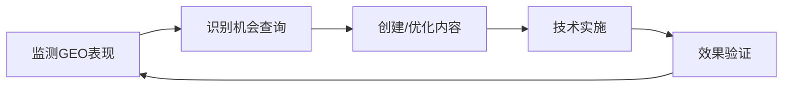

# 🎯 Eufy GEO竞争分析与行动计划

## 📊 当前竞争格局

基于最新的分析数据：

### AI Overview可见度排名
1. **Arlo**: 75.3/100 🥇
2. **Ring**: 68.5/100 🥈  
3. **Nest**: 62.1/100 🥉
4. **Eufy**: 45.7/100 (与领先者差距~30分)
5. **Wyze**: 42.3/100

### 关键发现

#### 竞争对手成功模式
通过对Arlo和Ring的深度分析，发现他们在AI Overview中的成功基于以下内容策略：

**1. 内容结构优化**
- ✅ 清晰的标题层级（H1, H2, H3）
- ✅ 大量使用项目符号列表
- ✅ 步骤化的教程内容
- ✅ 完整的FAQ部分

**2. 快速答案优化**
- ✅ 在文章开头提供简明答案
- ✅ 使用"Quick Answer"或"At a glance"部分
- ✅ 重点内容用粗体标注
- ✅ 关键信息前置

**3. 专业内容深度**
- ✅ 详细的产品比较表格
- ✅ 技术规格清晰呈现
- ✅ DIY安装指南
- ✅ 故障排除流程

## 🚀 立即执行计划（本周）

### Day 1-2: 内容审计与优化

#### 任务1: 审计现有内容
```bash
# 使用Firecrawl扫描Eufy现有内容
/analyze @eufy.com --firecrawl --focus "content-structure ai-readiness"
```

重点检查：
- [ ] 标题结构是否清晰
- [ ] 是否有快速答案部分
- [ ] FAQ覆盖程度
- [ ] 列表和表格使用情况

#### 任务2: 优化前10篇高流量文章
基于以下模板立即优化：

```markdown
# [主标题 - 包含目标关键词]

## 快速答案（Quick Answer）
**30秒了解要点：**
- 要点1（最重要）
- 要点2（次重要）
- 要点3（补充信息）

## 详细内容

### 1. [第一个主要部分]
[内容使用段落+列表结合]

### 2. [第二个主要部分]
[包含步骤化内容]

## 常见问题（FAQ）
**Q1: [用户最常问的问题]**
A: [简洁明确的答案]

**Q2: [第二常见问题]**
A: [答案]

## 专家建议
[独特见解，突出Eufy优势]
```

### Day 3-4: 创建新的GEO优化内容

#### 高优先级内容主题：
1. **"Eufy vs Arlo vs Ring：2024年终极对比"**
   - 突出无订阅费优势
   - 本地存储安全性
   - 性价比分析

2. **"智能家居安防摄像头完整安装指南"**
   - 步骤化安装流程
   - 常见问题解决
   - 视频辅助说明

3. **"如何选择最适合的家庭安防系统"**
   - 决策流程图
   - 需求评估清单
   - 产品推荐矩阵

### Day 5: 技术优化

#### Schema标记实施
```html
<script type="application/ld+json">
{
  "@context": "https://schema.org",
  "@type": "HowTo",
  "name": "如何安装Eufy安防摄像头",
  "step": [{
    "@type": "HowToStep",
    "text": "步骤1：下载Eufy Security应用"
  }]
}
</script>
```

#### 页面性能优化
- [ ] 确保页面加载时间 < 3秒
- [ ] 实施图片懒加载
- [ ] 优化移动端体验

## 📈 中期策略（2-4周）

### 1. 内容生产流水线

**每周产出目标：**
- 5篇GEO优化的操作指南
- 3篇产品对比文章
- 2篇技术深度文章

### 2. 独特价值主张强化

**Eufy差异化内容策略：**
- 🔒 **隐私保护专题** - "为什么本地存储更安全"
- 💰 **无订阅费优势** - "终身免费vs月费订阅"
- 🔋 **电池寿命领先** - "365天待机的秘密"
- 🤖 **AI功能本地化** - "不依赖云端的智能识别"

### 3. 监控与迭代

```bash
# 每周运行GEO监控
./run-enhanced-geo-analysis.sh

# 分析竞争对手新内容
/analyze @arlo.com @ring.com --changes-since "1 week ago"
```

## 🎯 成功指标

### 短期目标（1个月）
- [ ] GEO得分提升至 55+/100
- [ ] AI Overview出现率达到 40%
- [ ] 超越Wyze，接近Nest

### 中期目标（3个月）
- [ ] GEO得分达到 65+/100
- [ ] 进入前3名
- [ ] 关键查询AI Overview覆盖率 > 60%

## 💡 关键执行要点

### Do's ✅
1. **每篇文章都要有"快速答案"部分**
2. **使用编号步骤和项目符号列表**
3. **在标题中使用问句格式**
4. **突出Eufy独特优势**
5. **保持内容更新频率**

### Don'ts ❌
1. **避免冗长的段落**
2. **不要忽视移动端优化**
3. **避免过度技术化的语言**
4. **不要复制竞争对手内容**
5. **避免忽视用户反馈**

## 🔄 持续优化循环



## 📞 团队协作

### 内容团队
- 负责每日内容创建
- 遵循GEO优化模板
- 收集用户问题

### 技术团队
- 实施Schema标记
- 优化页面性能
- 监控技术指标

### 营销团队
- 推广优化内容
- 收集用户反馈
- 分析转化数据

---

**记住：** GEO成功的关键在于创建真正有价值、结构清晰、易于AI理解的内容。Eufy的独特优势（隐私、无订阅、本地化）是我们赢得AI Overview的差异化武器！🚀